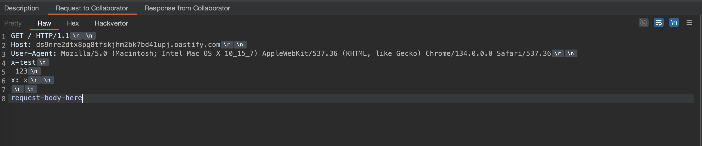

# sw33tLie's net/http

This is a fork of the Go standard library's `net/http` package that removes several validation checks that can be restrictive when developing security tools and penetration testing utilities.

## Purpose

The standard `net/http` package enforces various RFC compliance checks that, while appropriate for production applications, can hinder security research and testing. This fork relaxes these restrictions to allow for more flexible HTTP request crafting.

## Patches

The following modifications have been made:

- **Unrestricted header values**: All characters are now allowed in header field names and values (including spaces, tabs and similar)
- **No header canonicalization**: HTTP header names are not canonicalized anymore (e.g. `x-test: asd` is not changed to `X-Test: asd`)
- **Content-Length**: You can now disable sending the `Content-Length` header by calling `DoNotSendContentLength()`. Revert that anytime by calling `DoSendContentLength()`. By default, the `Content-Length` header is sent when a body is provided so that it doesn't break compatibility with tools that relied on the normal net/http behavior.
- **Default User-Agent**: The default user agent has been changed to a more common browser string (latest Chrome)
- **Invalid characters in HTTP method**: You can now use invalid characters in HTTP method names. This is particularly convinient when you want to manipulate the entire first line (path & http version) of the HTTP request, as you can use the method to set the entire line, then simply add a newline character and a bogus header name to make the final request valid:

```go
req, err := http.NewRequest("GET http://anything/ HTTP/0.9\r\nx: ", "http://example.com/", strings.NewReader("body"))
```

The final request will be:

```http
GET http://anything/ HTTP/0.9
x: / HTTP/1.1
Host: example.com
User-Agent: Mozilla/5.0 (Macintosh; Intel Mac OS X 10_15_7) AppleWebKit/537.36 (KHTML, like Gecko) Chrome/134.0.0.0 Safari/537.36
Content-Length: 4

body
```
Note that all patches have this comment to easily spot them in the code:

```
// sw33tLie patch
```

## Usage

First, install the package in your project:

```bash
go get github.com/sw33tLie/http
```

Then, replace your `net/http` import with `github.com/sw33tLie/http`:

```go
import (
	http "github.com/sw33tLie/http"
)
```

You're good to go!

## Code example

```go
package main

import (
	"crypto/tls"
	"fmt"
	"strings"

	http "github.com/sw33tLie/http"
)

func main() {
	req, err := http.NewRequest("GET", "http://ds9nre2dtx8pg8tfskjhm2bk7bd41upj.oastify.com", strings.NewReader("request-body-here"))
	if err != nil {
		fmt.Println(err)
		return
	}

	req.Header.Add("x-test\n 123\nx", "x")

	http.DoNotSendContentLength()
	// http.DoSendContentLength() // if you want to revert DoNotSendContentLength()

	client := &http.Client{
		Transport: &http.Transport{
			TLSClientConfig: &tls.Config{
				InsecureSkipVerify: true,
			},
			DisableCompression: true, // Avoid sending the Accept-Encoding: gzip header
		},
	}
	resp, err := client.Do(req)
	if err != nil {
		fmt.Println(err)
		return
	}

	fmt.Println(resp.StatusCode)
}

```

Collaborator request received:



Note how we crafted a malformed request but the library still sent it to the server.